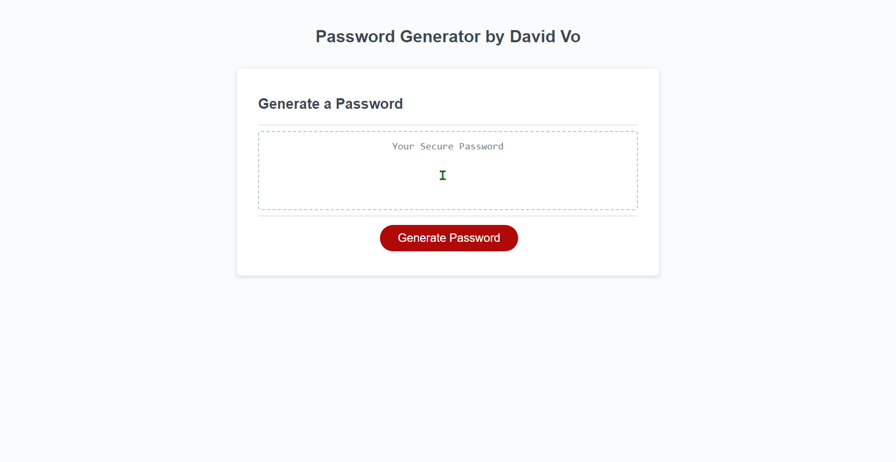

# Custom Password Generator

## Technology Used

| Technology Used         | Info URL           | 
| ------------- |:-------------:| 
| JavaScript | [https://developer.mozilla.org/en-US/docs/Web/JavaScript](https://developer.mozilla.org/en-US/docs/Web/JavaScript)     |  
| HTML    | [https://developer.mozilla.org/en-US/docs/Web/HTML](https://developer.mozilla.org/en-US/docs/Web/HTML) | 
| CSS     | [https://developer.mozilla.org/en-US/docs/Web/CSS](https://developer.mozilla.org/en-US/docs/Web/CSS)      |   
| Git | [https://git-scm.com/](https://git-scm.com/)     |  

---

## Description

This application is a password generator that creates a completely random password for you that has lowercase letters, uppercase letters, special characters (like !, @, #, $, etc.), and/or numbers!

Building this app solves one issue that is present with common password generators, like the one built into ChromeOS; the password is not stored locally and is at the whims of the platform you used. If the platform goes down, there's not a guarantee you'll have access to your information. 

By iterating randomly through a set of arrays, this password generator gives you a true random password with no intentional patterns given the criterias that you set. 

Plus, it can be used to store passwords locally!



---

## Table of Contents

* [Technology Used](#technology-used)
* [Description](#description)
* [Learning Points](#learning-points)
* [Iterating Through an Array Example](#iterating-through-an-array-example)
* [Usage](#usage)
* [Author Info](#author-info)
* [Credits](#credits)
* [License](#license)

---

## Learning Points

The biggest lesson learned through the creation of this app is how to parse and iterate through arrays properly so that data can be used in other functions. Without proper knowledge and understanding of that, this project definitely would not have been possible.

Another lesson learned was simply thinking through all of the possible edge cases that could occur when users actually got their hands on this application. Taking the time to think about "what happens if a user did this?" and "How would my code handle this type of input?" helped me plan out the design of this project.

Finally, the last big lesson learned was just how useful pseudo-coding is and the many benefits of it. By thinking through the basic structures of how things should work without instantly writing code definitely saved me a ton of time during development.

---

## Iterating Through an Array Example

The code below is an example of me iterating through an array in order to retrieve a random element in that array

```JavaScript
  const lcl = "abcdefghijklmnopqrstuvwxyz";
  const lcArray = lcl.split(""); //turns the lcl old string into an array

  function lcArrayFunc() {
    finalPassword.unshift(lcArray[(Math.floor(Math.random() * lcArray.length))]);
  }
```

By dissecting this function, we see that the code below is generating a random number within the length of the lcArray which will be any number between and including 0 and 25 

```JavaScript
(Math.floor(Math.random() * lcArray.length))
```

In the code below, we're taking the number that was randomly generated in the code above and using it as an index position in the lcArray

```JavaScript
lcArray[(Math.floor(Math.random() * lcArray.length))]
```

Once we have that random lowercase letter, we'll then add it to the final password that's shown to the user using the code below

```JavaScript
finalPassword.unshift(lcArray[(Math.floor(Math.random() * lcArray.length))]);
```

One thing to note is that by using the .unshift() modifier to the finalPassword array, it'll make the array into a string that is then presented to the user. Without .unshift() the code would simply return the array to the user and they would then have to remove the commas themselves.

---

## Usage

To use the random password generator, simply visit this website: [Random Password Generator](https://daevidvo.github.io/Custom-Password-Generator/)

Or you can download the contents of this repository and run index.html in your browser for a completely local experience.

---

## Author Info

### **David Vo**

* [Github](https://www.github.com/daevidvo)
* [LinkedIn](https://www.linkedin.com/in/daevidvo)

---

## Credits

While creating this application, I encountered some obstacles that stalled me for a good hour. 

For example, the isNaN function was crucial to solve a case where the user inputs anything other than a number into the password generator. Without it, the generator would've gone through and generated a password regardless. 

Now, the password generator is able to tell whether the user inputs a number specifically and continues on or terminates depending on the user input.

* [isNaN](https://developer.mozilla.org/en-US/docs/Web/JavaScript/Reference/Global_Objects/isNaN)

Some other worthwhile links that really helped me in building this application can be found below: 

* [JavaScript Array Methods and Properties](https://www.w3schools.com/jsref/jsref_obj_array.asp)
* [JavaScript String Methods and Properties](https://www.w3schools.com/jsref/jsref_obj_string.asp)

---

## License

MIT License

Copyright (c) 2023 daevidvo

Permission is hereby granted, free of charge, to any person obtaining a copy
of this software and associated documentation files (the "Software"), to deal
in the Software without restriction, including without limitation the rights
to use, copy, modify, merge, publish, distribute, sublicense, and/or sell
copies of the Software, and to permit persons to whom the Software is
furnished to do so, subject to the following conditions:

The above copyright notice and this permission notice shall be included in all
copies or substantial portions of the Software.

THE SOFTWARE IS PROVIDED "AS IS", WITHOUT WARRANTY OF ANY KIND, EXPRESS OR
IMPLIED, INCLUDING BUT NOT LIMITED TO THE WARRANTIES OF MERCHANTABILITY,
FITNESS FOR A PARTICULAR PURPOSE AND NONINFRINGEMENT. IN NO EVENT SHALL THE
AUTHORS OR COPYRIGHT HOLDERS BE LIABLE FOR ANY CLAIM, DAMAGES OR OTHER
LIABILITY, WHETHER IN AN ACTION OF CONTRACT, TORT OR OTHERWISE, ARISING FROM,
OUT OF OR IN CONNECTION WITH THE SOFTWARE OR THE USE OR OTHER DEALINGS IN THE
SOFTWARE.